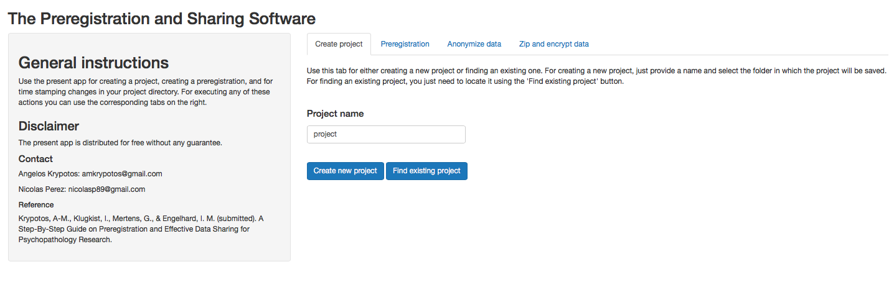
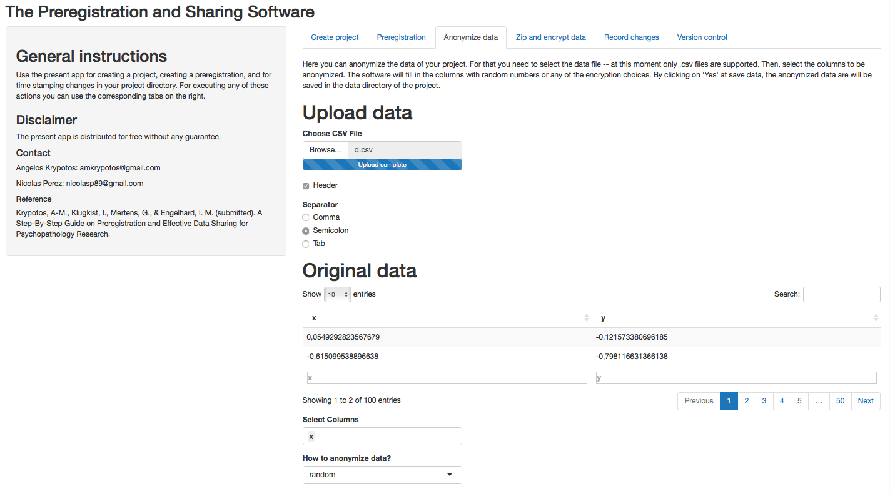
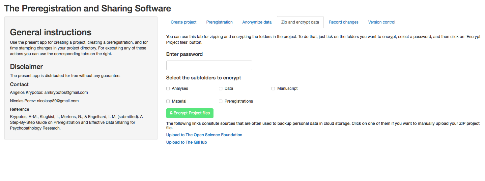

<style>
p.comment {
background-color: "white";
padding: 10px;
border: 1px solid black;
margin-left: 25px;
border-radius: 5px;
font-style: italic;
}

</style>

```{r setup, include=FALSE}
library(knitr)
knitr::opts_chunk$set(echo = TRUE)
```

This document provides a brief tutorial for the [pssr](https://github.com/AngelosPsy/pssr) R package. Specifically, we first provide instructions on how to (install the package)[#installation]. Then, we explain each tab of the package (one by one)[#initiat]. Lastly, we go through a [hypothetical example](#hexample). 

Our R package provides a suite of functions for preregistrating and sharing data/materials. Although it was initially designed as an easy-to-use tool for experimental psychopathologists and other researchers in clinical psychology, it can be used from any researcher running experimental studies. The rationale behind the design of the package can be found in the pre-print [A Step-By-Step Guide on Preregistration and Effective Data Sharing for Psychopathology Research](https://osf.io/yvnfj/). Now, we move on to the main part of the tutorial.

## Installation instructions {#installation}
Before installing the software, make sure that you have the most recent versions of the following software installed: [R](https://cran.r-project.org), [Rtools](https://cran.r-project.org/bin/windows/Rtools/), and [git](https://git-scm.com/]), [pandoc](https://github.com/jgm/pandoc). You can also choose between installing [MikTex](https://miktex.org/download) or [tinytex](https://yihui.name/tinytex/).

After that, start a new R session and paste the following commands in the R console.

```{r eval = FALSE}
if(!require(devtools)) { install.packages("devtools") } # Install devtools (in case you need to)
devtools::install_github("AngelosPsy/pssr")
```
If everything went as planned, the software is now ready to be used.

## Initiating a pssr session {#initiat}
The main function is the  pssr::shiny_app() which initiates a new [shiny](https://shiny.rstudio.com/) session. As in any other function in R, just paste

```{r  eval = FALSE}
pssr::shiny_app()
```

in the R console. After doing that, a new window will appear. We now explain each tab of the software.

## Create project Tab
For creating a new project, navigate to the 'Create project'. Then, place a name in the 'Project name' box and click on the 'Create new project'. In case you want to reopen an existing project, the user can just click on the 'Find existing project' box and navigate to an existing project. In case a folder is selected that was not created by the $pssr$, the program returns a warning. 

When a project folder is created, the program automatically creates a directory with the project's name. Inside the directory the following subdirectories are created: "analyses", "data", "manuscript", "material", and "preregistration". 

```{r  out.width = "80%", echo=FALSE}
 
```

## Preregistration Tab
For creating a preregistration document, you can enter a name in the "Enter name of the preregistration". Then, choose template you want to use so as
to form your preregistration. The pssr software supports 3 templates. These are the 'pss', the 'aspredicted' from the [aspredicted](aspredicted.org) website,
and the 'osf' from the (osf)[osf.io] website. In case the 'pss' template is selected, then a new tab is presented, with each tab now having different boxes
for every different piece of information that needs to be preregistrated (e.g., methods, statistical analyses). We describe more about this type of information
in our paper.

In case the 'aspredicted' or the 'osf' template are selected, then a new window will appear. The user then can use manipulate the text using the (Rmarkdown)[https://rmarkdown.rstudio.com] template. For these templates, we use the (prereg)[https://cran.r-project.org/web/packages/prereg/index.html] package
authored by (Frederik Aust)[https://github.com/crsh]. 

### Generate a pdf of the pregistration file
Under 'Preregistration' press 'Choose files'. On the pop up window, go to the 'preregistration' folder. Inside that folder, select the
'.Rmd' file with the name of the preregistration file you want to manipulate and click on 'Select'. After that, click on the 'Create PDF's'.
Then the pdf files of the preregistration files are now being saved in the 'preregistration' folder.

```{r  out.width = "80%", echo=FALSE}
include_graphics("figures/p.png") 
```

## Anonymize data
Our software can also be used to anonymize data. For that, navigate to the 'Anonymize data' folder. Then, choose a CSV file that can be used for
anonymizing data. The software currently accepts only csv files. After that, select the columns that will be anonymized. After selecting the columns,
you can select either to fill in the columns using random numbers or just encryption algorithms by clicking one of the options in the drop down menu named
'How to anonymize data?'.

```{r  out.width = "80%", echo=FALSE}
 
```

## Zip and encrypt data
The full project can be zipped and encrypted so that it can be easily shared with the rest of the community. For that, navigate to the 'Zip and encrypt data'
tab. Then, enter the password you want, select the columns that you want to zip and encrypt, and then click on the 'Encrypt Project files'.

```{r  out.width = "80%", echo=FALSE}
 
```

# Hypothetical example {#hexample}

For this example, we are going to be based on the preregistration of the study ("Modality-specific dual-task interference on aversive memories")[https://osf.io/zgw3r/], written by Gaëtan Mertens, Vera Bouwman, Jonas Asmervik, & Iris M. Engelhard. Please note that we describe below more steps than the ones used in the preregistration.

# Step one: Initialise a project
First, we start by initializing a project by using the command `{r  eval = FALSE} pssr::shiny_app()`. If everything worked as planned, a new project is initialized.

# Step two: Fill in the details in the 'Create Project' tab {#step2}

Here, we first fill in the name of our project (i.e., Modality-specific dual-task interference on aversive memories). Then, we click on the _Create new project_ tab. On the window that appears, you can select the directory (i.e., computer folder) where you want your project folders to be stored. If anything goes as planned, the directory that the project is stored will be written on screen. Please note that everytime you want to open the projet, you can just click on the "Find existsting project", locate the folder that contains your project (for the example that would be the folder named "Modality-specific dual-task interference on aversive memories") and open it. Please note that if a folder is selected that was not created by the pssr, a warning will be returned.

# Step three: Preregistration

Now that the project has been created (see (Step two)[#step2]), we are ready to create our preregistration document. For that, first click on the _preregistration_ tab. We first need to name our preregistration document. This could be something as simple as "preregistration". Then, we need to choose one of the available preregistration templates. The pssr provides 3 different preregistration templates: the pss, aspredicted, and cos templates. The last two templates were provided by the (prereg)[https://cran.r-project.org/web/packages/prereg/index.html] R package of (Frederik Aust)[https://github.com/crsh]. The first template was written by us and it is the template we describe in our relevant (paper)[https://osf.io/yvnfj/]. Here, we descibe only the pss template as for the other two, there other relevant resources (e.g., (https://osf.io/zab38/wiki/home/)[https://osf.io/zab38/wiki/home/]). 

In order to select the pssr template, the user can just select the template from the drop down menu named _choose a pre-registration template_. Then, click on the _+ Create_ button. After doing that, a new tab will be created, with separate boxes for each one of the fields that need to be filled in. Here, we provide within boxes the inforation we have provided.

### Title
<p class="comment">
Modality-specific dual-task interference on aversive memories
</p>

### Author list
<p class="comment">
Gaëtan Mertens, Vera Bouwman, Jonas Asmervik, & Iris M. Engelhard
</p>

### Affiliation list
<p class="comment">
Department of Clinical Psychology, Utrecht University
</p>

### Background of the study
Study questions
<p class="comment">
This study will investigate whether the reduction of self-reported vividness and emotionality of aversive memories in dual-task paradigms can be enhanced by using modality-specific interference. 
</p>

### Study hypotheses
<p class="comment">
A greater reduction in vividness and emotionality in visual memories is expected after a visuospatial taxation task compared to an auditory taxation task. In addition, a greater reduction in vividness and emotionality in auditory memories is expected after an auditory taxation task compared to a visuospatial taxation task.
</p>

### Methods
Stimuli
<p class="comment">
Three visual stimuli (IAPS pictures 9181, 3400, and 6350) and three auditory stimuli (IADS sounds 286, 275, and 279) are randomly assigned to the three tasks. 
</p>

### Questionnaires
<p class="comment">
No questionnaires are included in this study.
</p>

### Equipment
<p class="comment">
This study will be run on a standard laboratory PC. The experiment was programmed in Inquisit v4.0.
</p>

### Procedure
<p class="comment">
All participants will complete three tasks: (1) Control task: watching a white screen, (2) Visual task: detecting a target letter (e.g., p) between distractors (e.g., q) appearing alternatingly on the sides of the computer screen (Homer, Deeprose, & Andrade, 2016), (3) Auditory task: detecting a target letter (e.g., d) between distractors (e.g., e) presented by male and female voices on alternating sides of the headphone. During each of the tasks participants will have to recall their memory for either an emotional picture or sound (also on a within-subject basis).
</p>

### Protocol
<p class="comment">
</p>

### Statistical analyses

### Participant number
<p class="comment">
The sample size calculation is based on pilot data. As G-power does not allow for a repeated measures ANOVA within-within interaction, we calculated the sample size by using the dependent means t-test option. Therefore, we restructured the pilot data into two variables: congruent modality (M  reduction vividness = 21.53, SD = 19.99) and incongruent modality (M reduction vividness = 14.99, SD = 14.02) and determined the effect size (dz = 0.31). Sample size calculation using a dependent t-test with an a of .05 and statistical power of  1 - ß =  .80 indicated a required sample of 66 participants. Because of the counterbalance procedure (the sample size needs to be multipliable by 12) and feasibility, the final sample size will be 60 participants. Post hoc power calculations indicates that a power of .77 will be obtained with 60 participants, which we considered sufficient.
</p>

### Stopping rule
<p class="comment">
Data collection will continue until valid data for 60 participants is obtained.
</p>

### Confirm hypotheses
<p class="comment">
The memory vividness and emotionality scores will be analyzed separately in two repeated measures ANOVAs with task (visual, auditory, control) and stimuli (visual, auditory) as a within-subject factors and the difference scores (pre- and post-measurements) as dependent variable. To further explore the results, paired sample t-test will be performed to compare the different tasks per stimuli. The analyses will be conducted within the traditional null hypothesis testing framework (NHST) using an a  of .05.
</p>

### Disconfirm hypotheses
<p class="comment">
</p>

### Other
<p class="comment">
Not applicable.
</p>

### References
<p class="comment">
Baddeley, A. D. (1983). Working Memory. Philosophical Transactions of the Royal Society of London. Series B, Biological Sciences, 302, 311–324. https://doi.org/10.1098/rstb.1983.0057
Homer, S. R., Deeprose, C., & Andrade, J. (2016). Negative mental imagery in public speaking anxiety: Forming cognitive resistance by taxing visuospatial working memory. Journal of Behavior Therapy and Experimental Psychiatry, 50, 77–82. https://doi.org/10.1016/j.jbtep.2015.05.004,
</p>

# Step four: Anonymize data
The anonymize data tab can be used for anonymizing the data easily. Please note, though, that all functions are provided as an easy step ensuring anonymization of the data. However, all users should check whether indeed the data are fully anonymized before releasing them in public.

*To be filled in*

# Step five: Zip and encypt data
Here, we just type in a password in the _Enter password_ field. Then, we select all subfolders by clicking on the names of the subfolders. Lastly, we click on the _Encrypt Project files_ button. If anything went as predicted, the directory where the zip file was located should be shown on screen.

# Step six: Record changes
Although this is descibed as the sixth step, the tab named "Record changes" should be visited often during the whole project. Specifically, it is best to record as many changes as possible as this will provide a better view of the changes made throughout the whole project. In our example, we have just filled in a username and an email. Then, and every time we want to timestamp the changes made in the project, we just provide a brief description of the changes we have made (e.g., anonymized data) and then click on the 'timestamp changes'. Whenever we want to see if any changes have been made in the files, we can click on the 'track changes' button. 

As explained in our main paper, no new copies of the files are made. However, sometimes maybe the user wants to revert to an older version of the files. The _version control_ tab was designed for exactly this. For that, just click on the folders you want to revert to and then go to the commit you want to revert to using the _Go to Commit_ button. Please note that there should be at least one commit in order for this future to work. In case of no commits, the tab will return an error.
 


